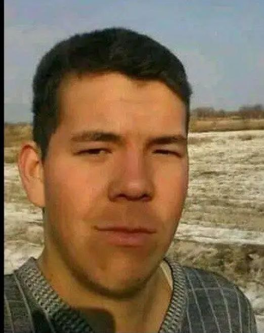

<!DOCTYPE html>
<html lang="uz">
<head>
  <meta charset="UTF-8">
  <title>Resume – Erpolat</title>
  <link rel="stylesheet" href="style.css">
</head>
<body>

  <!-- TIL TAŃLAW-->
  

     <button onclick="showLang('en')">English</button>
    <button onclick="showLang('kk')">Qaraqalpaq</button>
    <button onclick="showLang('uz')">O‘zbek</button>
    <button onclick="showLang('ru')">Русский</button>
    <button onclick="showLang('tr')">Türkçe</button>
  

  <!-- RASM -->
  
       class="profile" alt="Mening rasmim">

  <!-- QARAQALPAQ -->
  

    <h1>Erpolat Qazaxbaev</h1>
    
Kasbi:Bag‘darlamashi

    
<b>Ákesiniń ati:</b> Paraxat uli

    
<b>Tuwılǵan kúni:</b> 09.01.2002

    
<b>Bilimi:</b> INNOVATSION Texnologiyalar Universiteti

    
<b> Biletugin Tiller:</b> Turk, O‘zbek, Qazaq,Ingliz

    
<b>Biletugin Dasturiy Tilleri:</b> JavaScript, Python, C++, HTML/CSS

    
<b>Telefon:</b> 93-156-82-23

    
<b>Email-adressi:</b> qaraqalpaqerpolat@gmail.com

  

  <!-- O‘ZBEK -->
  

    <h1>Erpolat Qazaxbaev</h1>
    
Kasbi:Dasturchi

    
<b>Otasi ismi:</b> Paraxat o‘g‘li

    
<b>Tug‘ilgan sana:</b> 09.01.2002

    
<b>Ta’lim:</b> Innovatsion Texnologiyalar Universiteti

    
<b>Biladigan Tillar:</b> Turk, O‘zbek, Qozoq,Ingliz

    
<b>Telefon:</b> 93-156-82-23

    
<b>Email-adressi:</b> qaraqalpaqerpolat@gmail.com

    
<b>BILADIGAN DASTURIY TIL:</b> JavaScript, Python, C++, HTML/CSS

  

  <!-- RUS -->
  

    <h1>Eрполат Казахбаев</h1>
    
профессия:Программист

    
<b>Отчество:</b> Парахат улы

    
<b>Дата рождения:</b> 09.01.2002

    
<b>Образование:</b> Университет инновационных технологий

    
<b>Языки, на которых говорят:</b> Турецкий, Узбекский, Казахский,Английский

    
<b>знакомый программный язык:</b> JavaScript, Python, C++, HTML/CSS

    
<b>Телефон:</b> 93-156-82-23

    
<b>Email:</b> qaraqalpaqerpolat@gmail.com

  

  <!-- ENGLISH -->

  <h1>Erpolat Kazakhbaev</h1>
  
Profession: Programmer

  
<b>Father’s name:</b> Paraxat uli

  
<b>Date of birth:</b> 09.01.2002

  
<b>Education:</b> University of Innovative Technologies

  
<b>Languages:</b> Turkish, Uzbek, Kazakh,English

  
<b>Familiar program language:</b> JavaScript, Python, C++, HTML/CSS

  
<b>Phone:</b> 93-156-82-23

  
<b>Email:</b> qaraqalpaqerpolat@gmail.com

<!-- TURK -->

  <h1>Erpolat Kazahbayev</h1>
  
Meslek: Yazılımcı

  
<b>Baba adı:</b> Parahat oğlu

  
<b>Doğum tarihi:</b> 09.01.2002

  
<b>Eğitim:</b> İnovasyon Teknolojileri Üniversitesi

  
<b>Bildiği diller:</b> Türkçe, Özbekçe, Kazakça,  İngilizce

  
<b>Telefon:</b> 93-156-82-23

  
<b>E-posta:</b> qaraqalpaqerpolat@gmail.com

  

</body>
</html>
